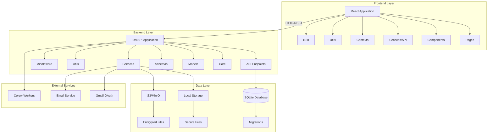
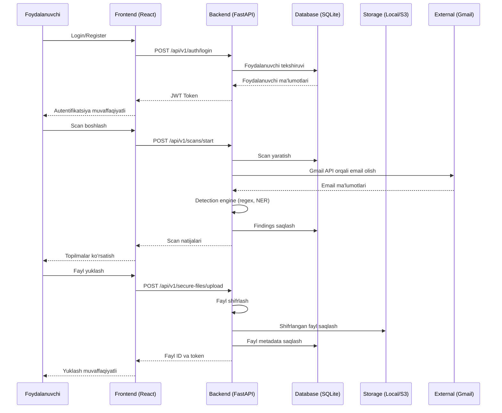
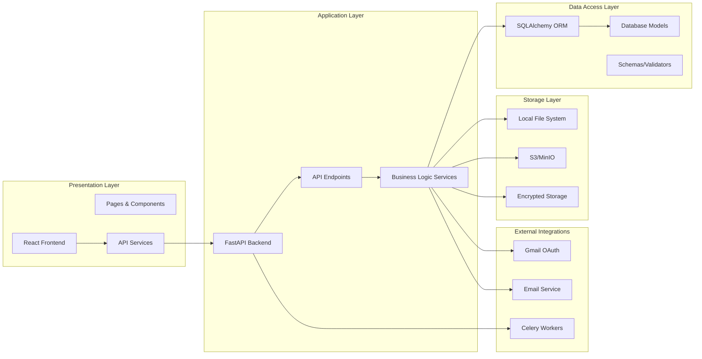
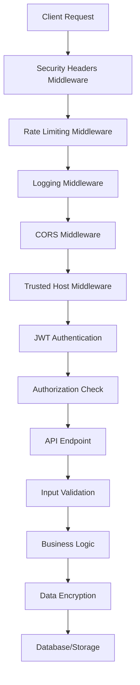
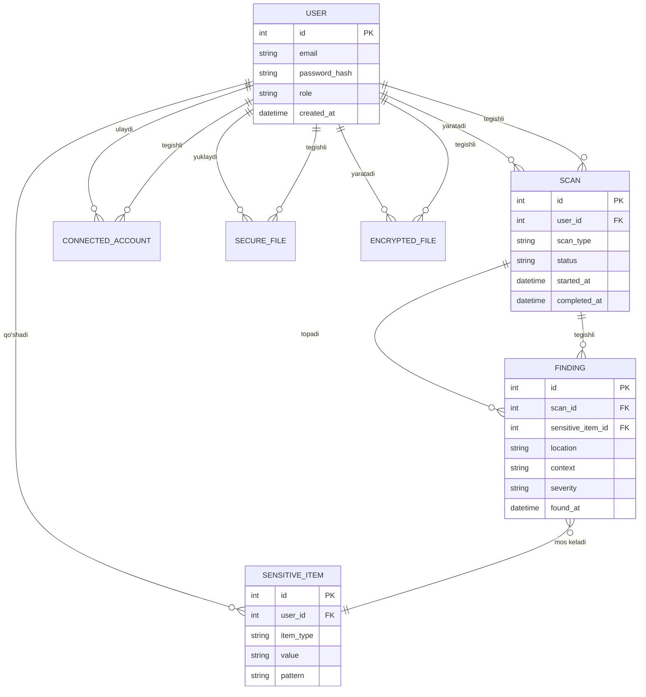
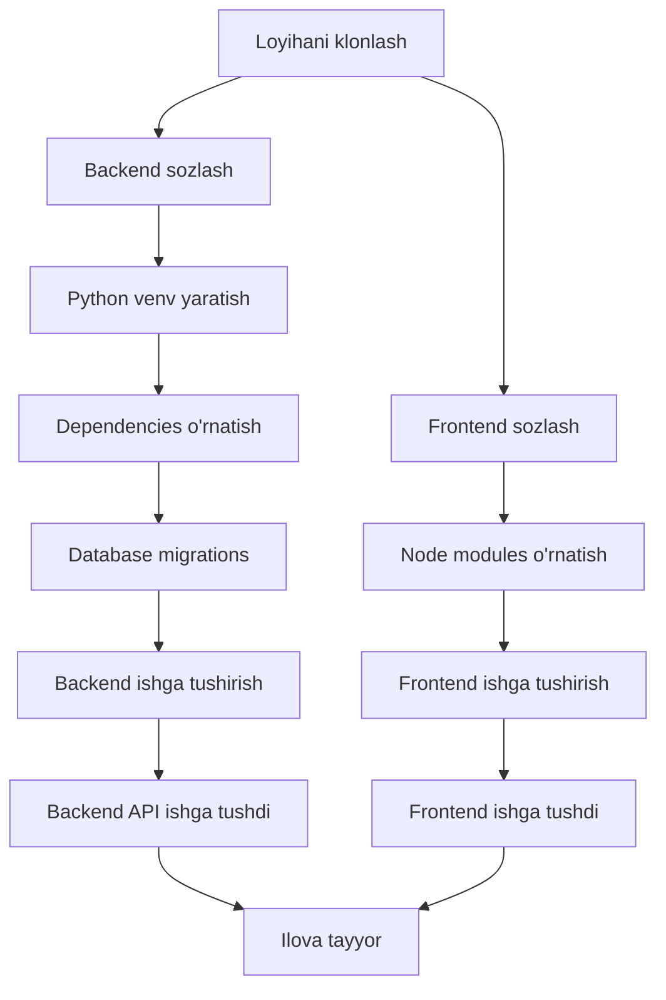

# Personal Leak Detector - Loyiha Strukturasi Sxemasi

## 📊 Umumiy Arxitektura Diagrami



## 🗂️ Detallangan Fayl Strukturasi

```
PERSONAL_LEAK_DETECTOR3/
│
├── 📁 backend/                          # Backend qismi (FastAPI)
│   ├── 📁 app/                          # Asosiy ilova kodi
│   │   ├── 📄 main.py                   # FastAPI ilova kirish nuqtasi
│   │   ├── 📄 celery_app.py            # Celery konfiguratsiyasi
│   │   │
│   │   ├── 📁 api/                      # API endpoints
│   │   │   ├── 📁 v1/                   # API versiya 1
│   │   │   │   ├── 📄 api.py            # API router birlashtiruvchi
│   │   │   │   └── 📁 endpoints/        # API endpoint fayllari
│   │   │   │       ├── 📄 auth.py       # Autentifikatsiya (login, register)
│   │   │   │       ├── 📄 users.py      # Foydalanuvchi boshqaruvi
│   │   │   │       ├── 📄 admin.py      # Admin panel endpoints
│   │   │   │       ├── 📄 scans.py      # Scan operatsiyalari
│   │   │   │       ├── 📄 findings.py   # Topilmalar boshqaruvi
│   │   │   │       ├── 📄 sensitive_items.py  # Sensitive itemlar
│   │   │   │       ├── 📄 secure_files.py    # Xavfsiz fayllar
│   │   │   │       ├── 📄 encrypted_files.py # Shifrlangan fayllar
│   │   │   │       ├── 📄 encryption.py      # Shifrlash API
│   │   │   │       ├── 📄 monitoring.py      # Monitoring endpoints
│   │   │   │       └── 📄 oauth.py          # OAuth integratsiyasi
│   │   │
│   │   ├── 📁 core/                     # Asosiy konfiguratsiya va xavfsizlik
│   │   │   ├── 📄 config.py             # Ilova sozlamalari
│   │   │   ├── 📄 security.py           # Xavfsizlik funksiyalari (JWT, hash)
│   │   │   ├── 📄 encryption.py         # Shifrlash funksiyalari
│   │   │   ├── 📄 exceptions.py         # Maxsus exceptionlar
│   │   │   ├── 📄 exception_handlers.py # Exception boshqaruvchilari
│   │   │   ├── 📄 middleware.py         # Logging middleware
│   │   │   ├── 📄 rate_limiter.py       # Rate limiting
│   │   │   ├── 📄 validators.py         # Ma'lumot validatsiyasi
│   │   │   └── 📄 timezone.py           # Vaqt zonalari
│   │   │
│   │   ├── 📁 models/                    # SQLAlchemy database modellari
│   │   │   ├── 📄 user.py               # Foydalanuvchi modeli
│   │   │   ├── 📄 scan.py               # Scan modeli
│   │   │   ├── 📄 finding.py            # Finding modeli
│   │   │   ├── 📄 sensitive_item.py     # Sensitive item modeli
│   │   │   ├── 📄 connected_account.py  # Ulangan hisoblar (Gmail, etc.)
│   │   │   ├── 📄 secure_file.py        # Xavfsiz fayl modeli
│   │   │   ├── 📄 encrypted_file.py     # Shifrlangan fayl modeli
│   │   │   └── 📄 audit_log.py          # Audit log modeli
│   │   │
│   │   ├── 📁 schemas/                   # Pydantic schemas (validatsiya)
│   │   │   ├── 📄 user.py               # Foydalanuvchi schemas
│   │   │   ├── 📄 scan.py               # Scan schemas
│   │   │   ├── 📄 finding.py            # Finding schemas
│   │   │   ├── 📄 sensitive_item.py     # Sensitive item schemas
│   │   │   ├── 📄 secure_file.py        # Secure file schemas
│   │   │   └── 📄 connected_account.py  # Connected account schemas
│   │   │
│   │   ├── 📁 services/                  # Business logic xizmatlari
│   │   │   ├── 📄 scan_service.py       # Scan logikasi
│   │   │   ├── 📄 email_service.py      # Email xizmati
│   │   │   ├── 📄 local_storage.py       # Lokal fayl saqlash
│   │   │   └── 📄 s3_storage.py         # S3/MinIO fayl saqlash
│   │   │
│   │   ├── 📁 utils/                     # Yordamchi funksiyalar
│   │   │   ├── 📄 detection.py          # Ma'lumot aniqlash logikasi
│   │   │   ├── 📄 file_processor.py     # Fayl qayta ishlash (OCR, parsing)
│   │   │   └── 📄 phishing_detector.py  # Phishing aniqlash
│   │   │
│   │   ├── 📁 middleware/                # Custom middleware
│   │   │   ├── 📄 rate_limit.py         # Rate limiting middleware
│   │   │   └── 📄 security_headers.py   # Xavfsizlik headerlari
│   │   │
│   │   ├── 📁 db/                        # Database konfiguratsiyasi
│   │   │   └── 📄 database.py           # SQLAlchemy engine va session
│   │   │
│   │   └── 📁 credentials/               # OAuth credentials (gitignore)
│   │
│   ├── 📁 migrations/                    # Alembic database migrations
│   │   ├── 📄 env.py                    # Migration environment
│   │   ├── 📄 script.py.mako            # Migration template
│   │   └── 📁 versions/                 # Migration versiyalari
│   │       ├── 📄 a8c0647cd608_add_encrypted_files_table.py
│   │       └── 📄 001_add_is_one_time_and_is_used_to_secure_files.py
│   │
│   ├── 📁 secure_files/                  # Shifrlangan fayllar saqlash joyi
│   ├── 📁 uploads/                       # Yuklangan fayllar
│   ├── 📄 pld.db                         # SQLite ma'lumotlar bazasi
│   ├── 📄 requirements.txt              # Python dependencies
│   ├── 📄 requirements-minimal.txt      # Minimal dependencies
│   ├── 📄 requirements-optional.txt     # Ixtiyoriy dependencies
│   ├── 📄 requirements-local.txt        # Lokal development dependencies
│   ├── 📄 Dockerfile                    # Docker image
│   ├── 📄 alembic.ini                   # Alembic konfiguratsiyasi
│   ├── 📄 create_admin.py               # Admin foydalanuvchi yaratish skripti
│   ├── 📄 start_backend.bat             # Backend ishga tushirish (Windows)
│   ├── 📄 start_local.bat               # Lokal ishga tushirish
│   ├── 📄 start.sh                      # Linux/Mac ishga tushirish
│   ├── 📄 setup_minio.ps1               # MinIO sozlash (PowerShell)
│   ├── 📄 setup_minio.sh                # MinIO sozlash (Bash)
│   └── 📄 start_minio.bat               # MinIO ishga tushirish
│
├── 📁 frontend/                          # Frontend qismi (React)
│   ├── 📁 src/                           # Source kodlar
│   │   ├── 📄 App.js                    # Asosiy React komponenti
│   │   ├── 📄 index.js                  # Entry point
│   │   ├── 📄 index.css                 # Global CSS
│   │   ├── 📄 setupProxy.js             # Development proxy sozlash
│   │   │
│   │   ├── 📁 pages/                     # Sahifa komponentlari
│   │   │   ├── 📄 Login.js              # Kirish sahifasi
│   │   │   ├── 📄 Register.js           # Ro'yxatdan o'tish
│   │   │   ├── 📄 Dashboard.js          # Bosh sahifa
│   │   │   ├── 📄 Monitoring.js         # Monitoring sahifasi
│   │   │   ├── 📄 Scans.js              # Scanlar ro'yxati
│   │   │   ├── 📄 Findings.js           # Topilmalar sahifasi
│   │   │   ├── 📄 Settings.js            # Sozlamalar
│   │   │   ├── 📄 AdminPanel.js          # Admin panel
│   │   │   ├── 📄 SafeShare.js          # Xavfsiz fayl almashish
│   │   │   ├── 📄 Download.js            # Fayl yuklab olish
│   │   │   └── 📄 EncryptedDownload.js  # Shifrlangan fayl yuklab olish
│   │   │
│   │   ├── 📁 components/                # Qayta ishlatiladigan komponentlar
│   │   │   ├── 📄 Layout.js             # Asosiy layout
│   │   │   ├── 📄 PrivateRoute.js        # Himoyalangan route
│   │   │   ├── 📄 AdminRoute.js         # Admin route
│   │   │   ├── 📄 LanguageSwitcher.js   # Til o'zgartirish
│   │   │   └── 📄 EncryptionExample.js  # Shifrlash misoli
│   │   │
│   │   ├── 📁 contexts/                  # React Context API
│   │   │   ├── 📄 AuthContext.js        # Autentifikatsiya context
│   │   │   └── 📄 LanguageContext.js    # Til context
│   │   │
│   │   ├── 📁 services/                  # API xizmatlari
│   │   │   ├── 📄 api.js                # Asosiy API xizmati
│   │   │   ├── 📄 encryptedApi.js       # Shifrlangan API xizmati
│   │   │   └── 📄 encryptedFilesApi.js  # Shifrlangan fayllar API
│   │   │
│   │   ├── 📁 utils/                     # Yordamchi funksiyalar
│   │   │   ├── 📄 encryption.js         # Frontend shifrlash
│   │   │   ├── 📄 fileEncryption.js     # Fayl shifrlash
│   │   │   ├── 📄 dateUtils.js          # Sana funksiyalari
│   │   │   └── 📄 useFindingsStats.js   # Custom hook (statistika)
│   │   │
│   │   └── 📁 i18n/                      # Xalqaroshlashtirish
│   │       ├── 📄 config.js             # i18n konfiguratsiyasi
│   │       └── 📁 locales/              # Tarjima fayllari
│   │           ├── 📄 uz.json           # O'zbekcha
│   │           └── 📄 ko.json           # Koreyscha
│   │
│   ├── 📁 public/                        # Statik fayllar
│   │   ├── 📄 index.html                # HTML template
│   │   ├── 📄 favicon.ico               # Favicon
│   │   └── 📄 favicon.svg               # Favicon SVG
│   │
│   ├── 📄 package.json                   # Node.js dependencies
│   ├── 📄 package-lock.json             # Dependency lock fayli
│   ├── 📄 tailwind.config.js            # Tailwind CSS konfiguratsiyasi
│   ├── 📄 postcss.config.js             # PostCSS konfiguratsiyasi
│   ├── 📄 Dockerfile                    # Docker image
│   └── 📄 start_frontend.bat            # Frontend ishga tushirish
│
├── 📄 docker-compose.yml                # Docker Compose konfiguratsiyasi
├── 📄 start_local.bat                   # Lokal ishga tushirish (root)
├── 📄 local_setup.bat                   # Lokal sozlash
│
└── 📁 Documentation/                    # Hujjatlar
    ├── 📄 README.md                     # Asosiy README
    ├── 📄 ENCRYPTION_USAGE.md           # Shifrlash qo'llanmasi
    ├── 📄 Loyiha_Haqida_Malumot.md      # Loyiha haqida ma'lumot
    ├── 📄 Taqdimot_To'liq_Loyiha_Tafsilotlari.md
    └── 📄 PPT_Ideal_Struktura_12-20_Slayd.md
```

## 🔄 Ma'lumot Oqimi Diagrami



## 🏗️ Arxitektura Komponentlari



## 🔐 Xavfsizlik Arxitekturasi



## 📦 Asosiy Modullar va Ulanishlar

### Backend Modullari:

1. **API Layer** (`app/api/v1/endpoints/`)
   - `auth.py` - Autentifikatsiya va ro'yxatdan o'tish
   - `users.py` - Foydalanuvchi boshqaruvi
   - `scans.py` - Scan operatsiyalari
   - `findings.py` - Topilmalar boshqaruvi
   - `sensitive_items.py` - Sensitive itemlar
   - `secure_files.py` - Xavfsiz fayllar
   - `encrypted_files.py` - Shifrlangan fayllar
   - `admin.py` - Admin funksiyalari
   - `monitoring.py` - Monitoring va statistika

2. **Core Layer** (`app/core/`)
   - `config.py` - Ilova sozlamalari
   - `security.py` - JWT, password hashing
   - `encryption.py` - Shifrlash algoritmlari
   - `exceptions.py` - Maxsus exceptionlar
   - `validators.py` - Ma'lumot validatsiyasi

3. **Service Layer** (`app/services/`)
   - `scan_service.py` - Scan logikasi
   - `email_service.py` - Email xizmati
   - `local_storage.py` - Lokal saqlash
   - `s3_storage.py` - S3 saqlash

4. **Utils Layer** (`app/utils/`)
   - `detection.py` - Ma'lumot aniqlash
   - `file_processor.py` - Fayl qayta ishlash
   - `phishing_detector.py` - Phishing aniqlash

### Frontend Modullari:

1. **Pages** (`src/pages/`)
   - `Login.js`, `Register.js` - Autentifikatsiya
   - `Dashboard.js` - Bosh sahifa
   - `Scans.js`, `Findings.js` - Scan va topilmalar
   - `Settings.js` - Sozlamalar
   - `AdminPanel.js` - Admin panel

2. **Services** (`src/services/`)
   - `api.js` - Asosiy API xizmati
   - `encryptedApi.js` - Shifrlangan API
   - `encryptedFilesApi.js` - Shifrlangan fayllar

3. **Contexts** (`src/contexts/`)
   - `AuthContext.js` - Autentifikatsiya holati
   - `LanguageContext.js` - Til holati

## 🗄️ Database Schema



## 🚀 Ishga Tushirish Jarayoni



## 📝 Qo'shimcha Ma'lumotlar

- **Backend Port**: 8000
- **Frontend Port**: 3000
- **Database**: SQLite (development), PostgreSQL (production)
- **Authentication**: JWT tokens
- **File Storage**: Local filesystem yoki S3/MinIO
- **Background Tasks**: Celery
- **API Documentation**: Swagger UI (`/docs`)

---

*Bu sxema Personal Leak Detector loyihasining to'liq strukturasini ko'rsatadi.*

